<!DOCTYPE html>
<html lang="fr">

<head>
    <meta charset="UTF-8">
    <meta http-equiv="X-UA-Compatible" content="IE=edge">
    <meta name="viewport" content="width=device-width, initial-scale=1.0">
</head>

<body>

<h1> Rapport Angular : Application de Gestion de Produits </h1>

<h2 style="color: #6091da;">Introduction</h2>

   Ce rapport détaille le développement d'une application de gestion de produits,
exploitant le framework Angular. L'objectif central de cette application est de mettre à disposition une interface utilisateur moderne et réactive, simplifiant les opérations liées à la visualisation, la recherche,
la modification et la suppression des produits.

<h2 style="color: #6091da;">Exploration d'Angular</h2>
 

   Angular a été sélectionné pour ce projet en raison de sa robustesse dans la création
d'applications web modulaires et faciles à entretenir. Dans les prochaines sections, 
nous examinerons en détail les caractéristiques principales de l'application, son architecture, 
et la façon dont Angular a été exploité pour atteindre ces objectifs. Nous mettrons en lumière les avantages spécifiques 
qu'Angular apporte à ce projet.

<h2 style="color: #6091da;">Énoncé</h2>

Créer une application web basée sur Angular qui permet de gérer les produits. Chaque Produit est défini par son id, name, price,  chacked. Le backend de l'application est basé sur une REST API basée sur Json-Server
L'application doit permettre de :

<ul>
    <li>Afficher les produits</li>
    <li>Chercher les produits</li>
    <li>Faire la pagination</li>
    <li>Supprimer un produit</li>
    <li>Éditer un produit</li>
    <li>Mettre à jour un produit</li>
    <li>Faire l'authentification et protéger les routes</li>
</ul>

<h2 style="color: #6091da;">Structure de l'Application</h2>

    L'architecture de l'application Angular repose sur des modules comprenant divers composants, services et gardiens.

<h3 style="color: #f9de50;">1. Creation d'un Composant</h3>
<pre style= "padding: 10px;">
// Créer un Composant
ng g c nom-composant
</pre>
<ul>
    <li><strong>NavbarComponent :</strong> La barre de navigation affiche des liens vers différentes sections de l'application
        et propose des actions utilisateur telles que la connexion et la déconnexion.</li>
    <li><strong>ProductsComponent :</strong> Présente la liste paginée des produits avec des fonctionnalités de recherche,
        suppression, édition et mise à jour.</li>
    <li><strong>NewProductComponent :</strong> Permet à l'utilisateur d'ajouter un nouveau produit à la liste.</li>
    <li><strong>EditProductComponent :</strong> Offre un formulaire d'édition pour mettre à jour les détails d'un produit
        existant.</li>
    <li><strong>LoginComponent :</strong> Gère le processus d'authentification de l'utilisateur.</li>
</ul>

<h3 style="color: #f9de50;">2. Creation d'un Service</h3>
<pre style= "padding: 10px;">
// Créer un Service
ng g s nom-service
</pre>
<ul>
    <li><strong>AppStateService :</strong> Gère l'état global de l'application, stockant des informations sur les produits et
        l'état d'authentification.</li>
    <li><strong>AuthService :</strong> Gère l'authentification des utilisateurs en vérifiant les informations d'identification
        et en stockant l'état d'authentification.</li>
    <li><strong>ProductService :</strong> Interagit avec la REST API pour effectuer des opérations liées aux produits telles que
        la récupération, la création, la mise à jour et la suppression.</li>
    <li><strong>LoadingService :</strong> Gère l'affichage d'un indicateur de chargement pour informer l'utilisateur lors du
        chargement de données.</li>
</ul>

<h3 style="color: #f9de50;">3. Creation d'un Gardien</h3>
<pre style= "padding: 10px;">
// Créer un Gardien 
ng g g nom-gardien
</pre>
<ul>
    <li><strong>AuthenticationGuard :</strong> Protège les routes nécessitant une authentification. Redirige les utilisateurs
        non authentifiés vers la page de connexion.</li>
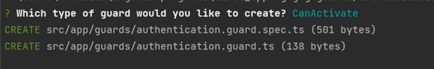
    <li><strong>AuthorizationGuard :</strong> Protège les routes en fonction des rôles de l'utilisateur. Redirige les utilisateurs
        non autorisés vers une page indiquant qu'ils ne sont pas autorisés.</li>
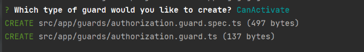
</ul>

<h3 style="color: #f9de50;">4. Creation d'un Interceptor</h3>
<pre style= "padding: 10px;">
// Créer un Interceptor
ng g interceptor nom-intercepteur
</pre>
<ul>
    <li><strong>AppHttpInterceptor :</strong> Intercepte les requêtes HTTP pour ajouter un en-tête d'autorisation avant qu'elles
        ne soient envoyées au serveur. Gère également l'affichage d'un indicateur de chargement pendant les requêtes.</li>
</ul>

<h2 style="color: #6091da;">Fonctionnalités</h2>

<h3 style="color: #f9de50;">1. Affichage des données statiques</h3>

    Dans un premier temps, on affiche les données avec une base de données statique dans un tableau.

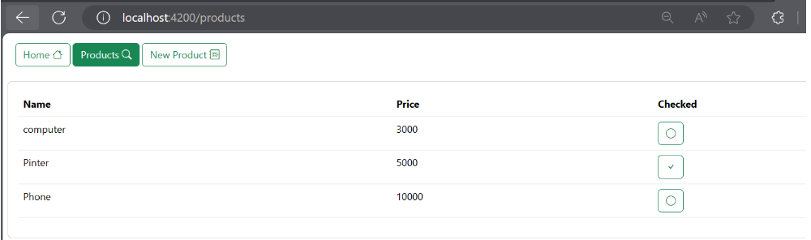

<h3 style="color: #f9de50;">2. Angular avec une REST API basée sur Json-Server</h3>

    La mise en place d'une REST API pour notre application Angular est facilitée grâce à l'utilisation de JSON Server.

<h4>2.1 Installation de JSON Server</h4>

    Tout d'abord, nous devons nous assurer d'avoir JSON Server installé globalement en exécutant la commande suivante dans le terminal :

<pre>
    <code>npm install -g json-server</code>
</pre>

<h4>2.2 Création du fichier de données </h4>

    Ensuite, nous créons un fichier de données nommé <strong>db.json</strong> contenant les informations sur nos produits ou d'autres données nécessaires.
    Nous plaçons ce fichier dans un dossier appelé <strong>data</strong>.

<pre>
// db.json
{
    "products": [
        // ... données des produits
    ],
    "users": [
        // ... données des utilisateurs
    ]
}</pre>
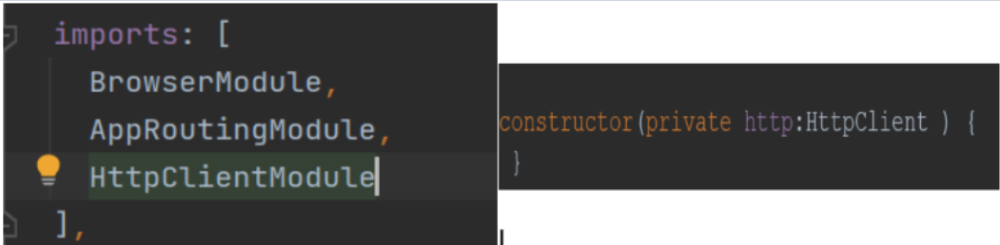

<h4>2.3 Lancement de JSON Server</h4>

    En utilisant la commande suivante on peut lancer JSON Server apres avoir specifier le chemin vers notre fichier <strong>db.json</strong> et le port (8089) :

<pre>
    <code>json-server -w data/db.json -p 8089</code>
</pre>

L'option -w est activée pour permettre le mode de surveillance des fichiers. Cela se révèle pratique lorsque nous désirons que JSON Server actualise automatiquement les données en fonction des modifications apportées au fichier db.json.

Cela initiera notre serveur API REST sur le port 8089. Nous avons la flexibilité de personnaliser ce port en fonction de nos préférences.

<h4>2.4 Execution</h4>

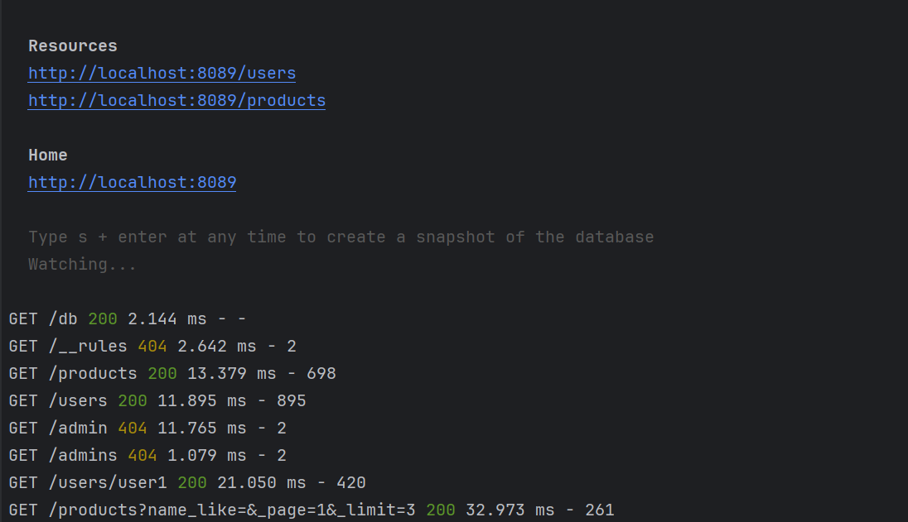

<h4>2.5 Envoi de requêtes HTTP vers le Backend</h4>

    Nous pouvons maintenant envoyer des requêtes HTTP à notre backend pour récupérer des données.Apres  l'importer du module correspondant
    dans le fichier <strong>app.module.ts</strong> de notre application Angular.

<h2 style="color: #6091da;"> Gestion des Droits d'Accès</h2>

<h3 style="color: #f9de50;">Génération des tokens avec JWT</h3>

Un jeton JWT contient des informations (revendications) sur un utilisateur et est signé numériquement pour garantir son intégrité. Il peut être utilisé pour authentifier et autoriser les utilisateurs dans un système sécurisé. Le champ "roles" est souvent utilisé pour définir les droits et les permissions associés à un utilisateur.

<h4>Admin</h4>
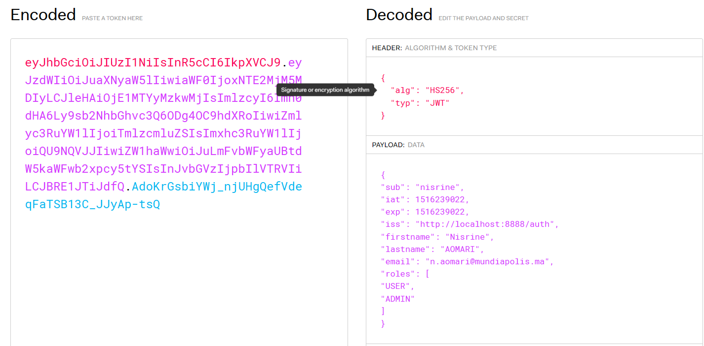
<h4>User normal</h4>

L'installation du Base64 helper pour le codage et le decodage du password.

<h2 style="color: #6091da;">Pages Accessibles aux Utilisateurs Normaux</h2>
<h4>Page d'authentification</h4>
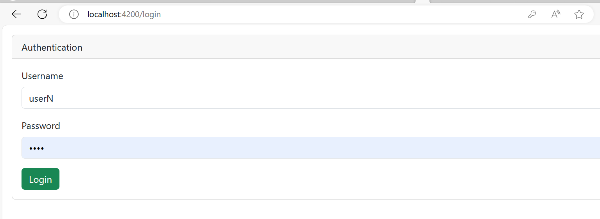
<h4>Page d'accueil</h4>
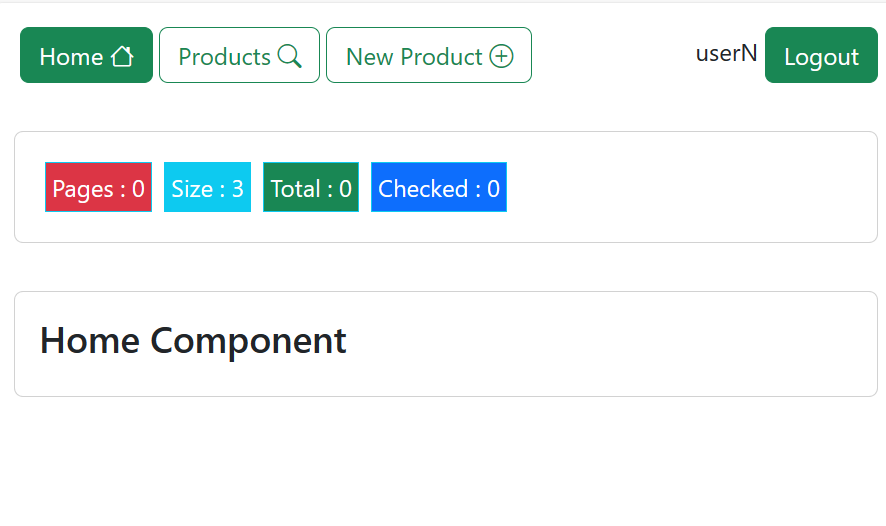
<h4>Affichage des Produits</h4>
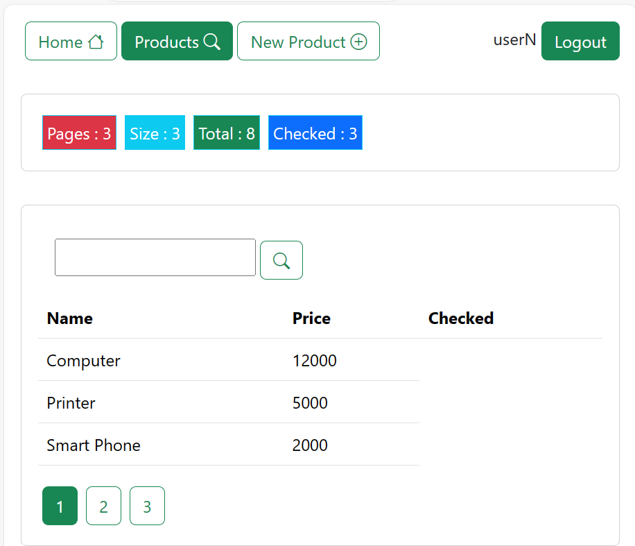
<h4>Recherche des Produits</h4>
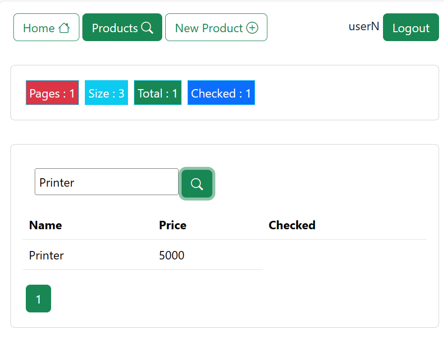
<h4>Ajout d'un Produit</h4>
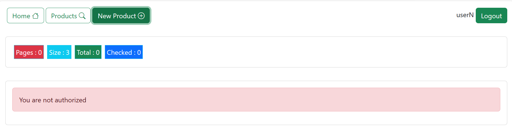

<h2 style="color: #6091da;">Pages Accessibles aux Administrateurs</h2>
<h4>Afficher la page d'authentification</h4>
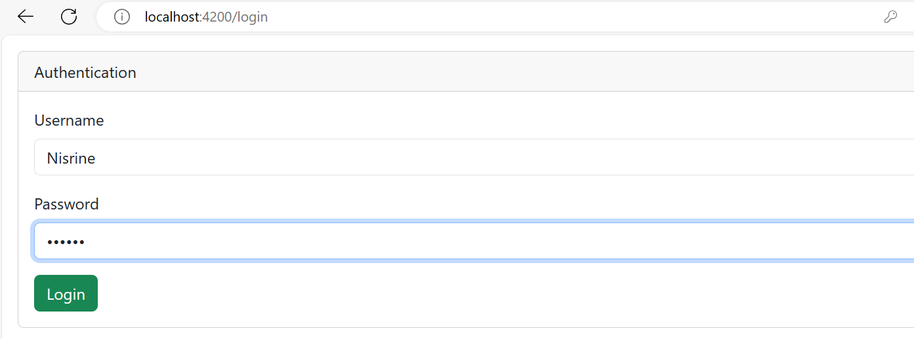
<h4>Afficher les Produits</h4>
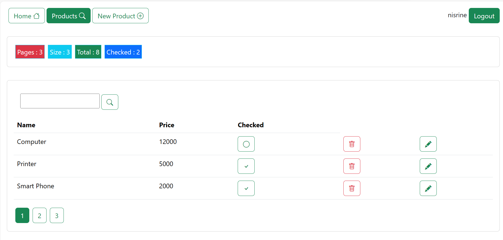
<h4>Rechercher les Produits</h4>
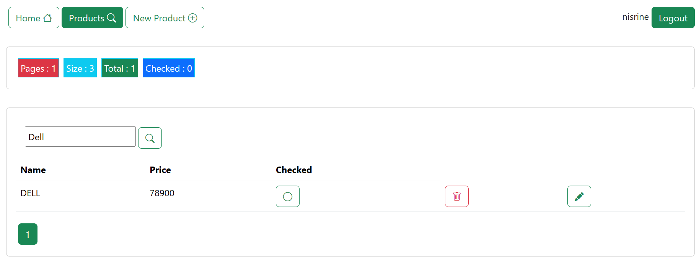
<h4>Ajouter un Produit</h4>
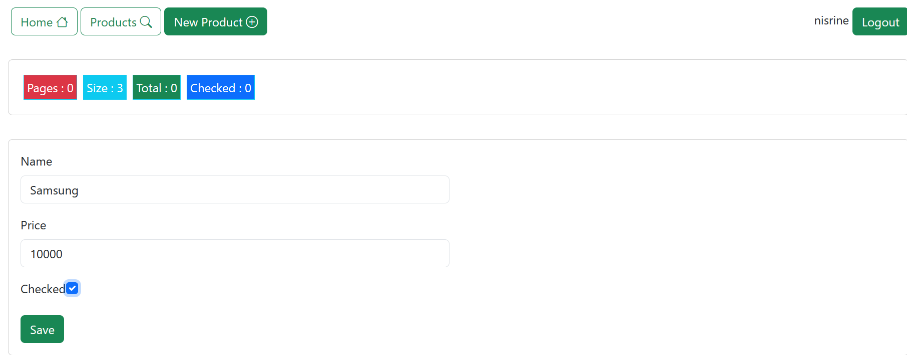
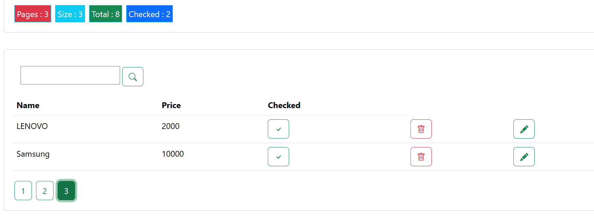
<h4>Modifier un Produit</h4>
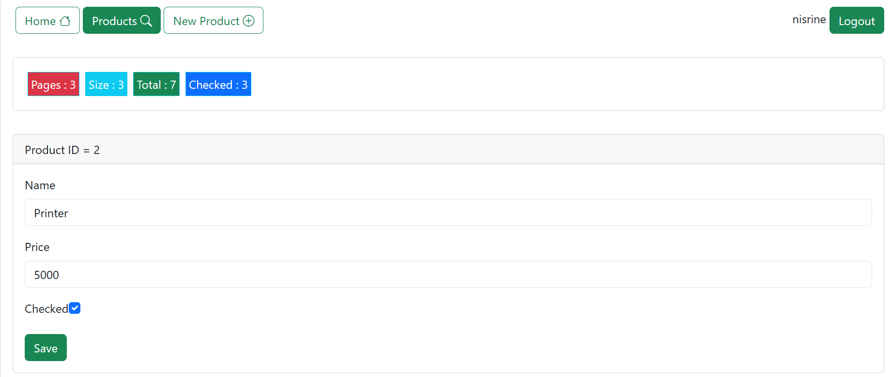
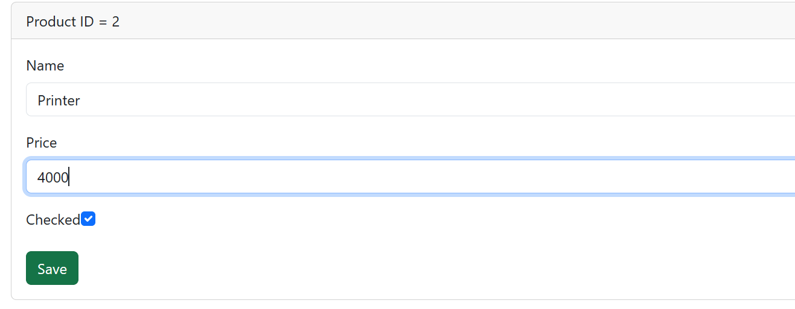
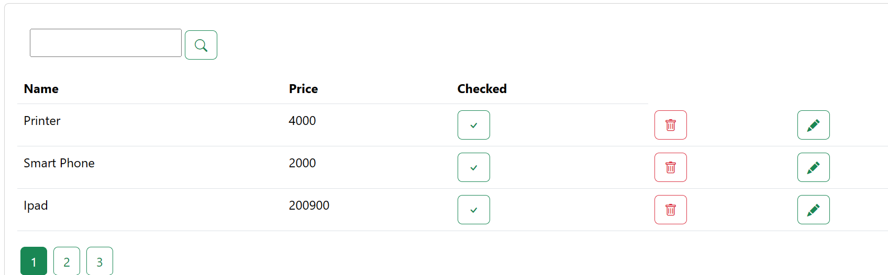
<h4>Supprimer un Produit</h4>
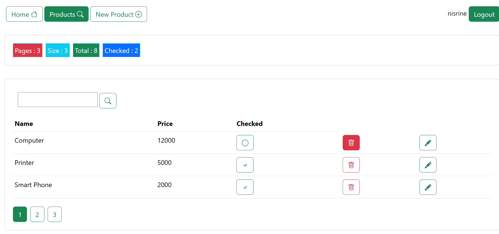
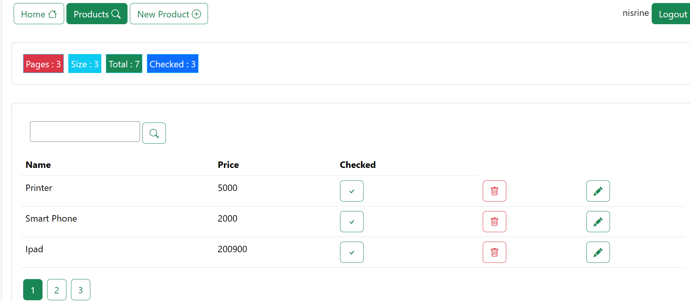

<h2 style="color: #6091da;">Conclusion</h2>

  Cette application Angular offre une expérience utilisateur conviviale pour la gestion des produits. Elle implémente des fonctionnalités essentielles telles que l'affichage des produits, la recherche, la pagination, la suppression, l'édition, la mise à jour, l'authentification avec protection des routes, ainsi que la gestion des droits d'accès différenciés entre les utilisateurs ordinaires et les administrateurs. L'architecture modulaire et les services bien définis permettent une maintenance facile et une évolutivité de l'application.

</body>

</html>
